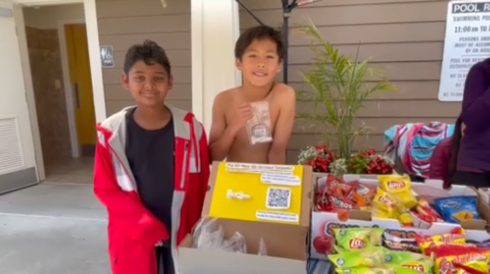
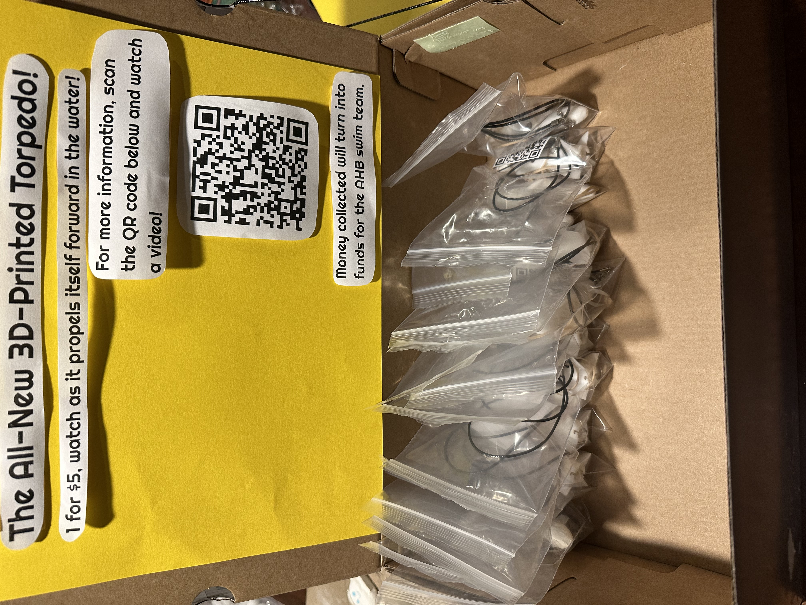
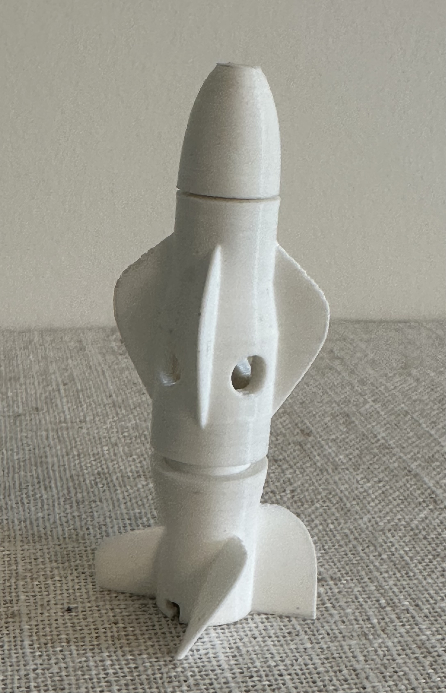

# Torpedo Fundraiser Project

## Overview

I've always loved engineering things for solving real life problems. This project is a custom 3D-printable torpedo pool toy that I designed using CAD software. The torpedo is powered by the elasticity of a rubber band and can self-propel underwater, making it an exciting and engaging pool toy.

## Project Success

By selling these torpedoes, I raised over **$400** for my swim team. The fundraise is an demonstration of what engineering and passion can do to support community causes.

## Images

<table>
  <tr>
    <td align="center">
      
    </td>
    <td align="center">
      
    </td>
    <td align="center">
      
    </td>
  </tr>
  <tr>
    <td align="center">
      
    </td>
    <td align="center">
      
    </td>
    <td align="center">
      
    </td>
  </tr>
</table>

## Features

- **3D-Printable Design**: Custom CAD model optimized for 3D printing
- **Rubber Band Propulsion**: Self-propelling mechanism powered by elastic energy
- **Easy Maintenance**: Replaceable rubber bands for extended use
- **Pool-Safe**: Designed specifically for underwater use
- **Wearibility**: features a built-in attachment point to a necklace chain, which prevents you from losing it

## Demo Video

Watch the introduction and advertisement video, which includes instructions on how to change the rubber bands:

  
  
<i>Click to watch the demonstration</i>

 

## Links & Resources

<table>
  <tr>
    <td align="center">
      
    </td>
    <td align="center">
      
    </td>
    <td align="center">
      
    </td>
  </tr>
</table>

- **3D CAD Files**:
<blockquote>
<ul>
  <li><a href="CadFiles/TorpedoBody.stl">Torpedo Body</a></li>
  <li><a href="CadFiles/TorpedoRingBarringHolder.stl">Ring Barring Holder</a></li>
  <li><a href="CadFiles/TorpedoPropellerTail.stl">Propeller Tail</a></li>
  <li><a href="CadFiles/TorpedoInteriorHook.stl">Interior Hook</a></li>
  <li><a href="CadFiles/TorpedoNose.stl">Torpedo Nose</a></li>
</ul>
</blockquote>

- [Assembly Instructions](https://youtu.be/7xv1Zauf7r4?t=41)

## How It Works

The torpedo uses the stored elastic energy from a wound rubber band to propel itself through the water. When released, the rubber band unwinds, spinning an internal mechanism that drives the torpedo forward.

## Contributing

If you are interested in improving the design or have suggestions, feel free to open an issue or submit a pull request!

## Contact

**Name**: Jason Zhang

**Email**: jason.zhang.duidui@gmail.com

---

*Built with passion for swimming and engineering*
